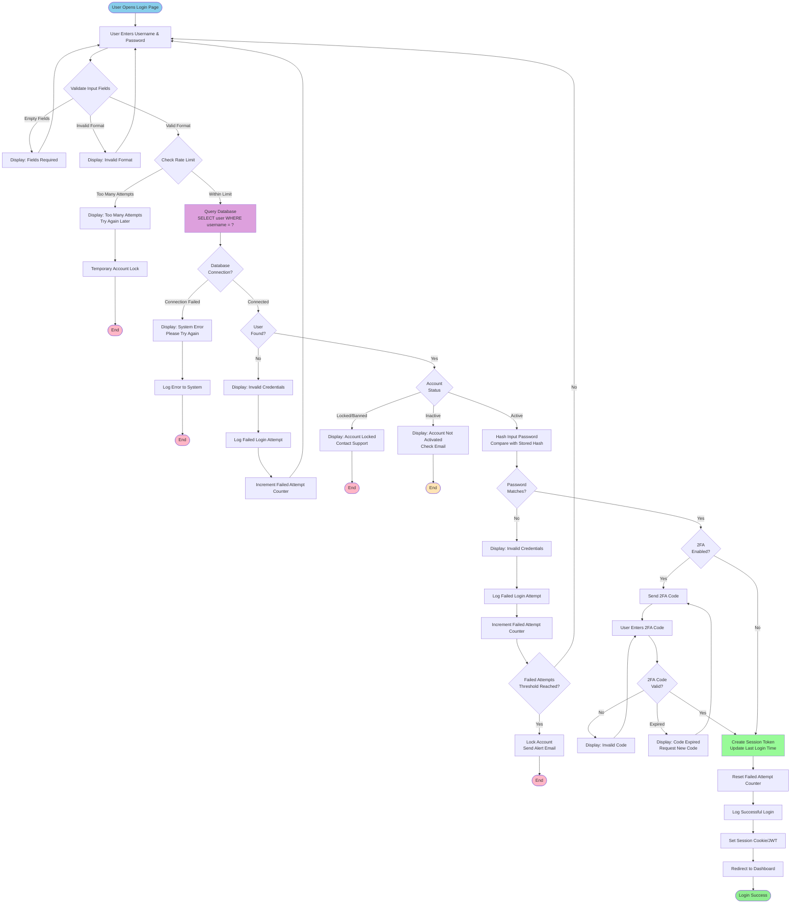

```mermaid
flowchart TD
    Start([User Opens Login Page]) --> InputCreds[User Enters Username & Password]
    InputCreds --> ValidateInput{Validate Input Fields}
    
    ValidateInput -->|Empty Fields| EmptyError[Display: Fields Required]
    EmptyError --> InputCreds
    
    ValidateInput -->|Invalid Format| FormatError[Display: Invalid Format]
    FormatError --> InputCreds
    
    ValidateInput -->|Valid Format| CheckRateLimit{Check Rate Limit}
    
    CheckRateLimit -->|Too Many Attempts| RateLimitError[Display: Too Many Attempts<br/>Try Again Later]
    RateLimitError --> BlockTemp[Temporary Account Lock]
    BlockTemp --> End1([End])
    
    CheckRateLimit -->|Within Limit| QueryDB[Query Database<br/>SELECT user WHERE username = ?]
    
    QueryDB --> DBError{Database<br/>Connection?}
    DBError -->|Connection Failed| DBErrorMsg[Display: System Error<br/>Please Try Again]
    DBErrorMsg --> LogError[Log Error to System]
    LogError --> End2([End])
    
    DBError -->|Connected| UserExists{User<br/>Found?}
    
    UserExists -->|No| UserNotFound[Display: Invalid Credentials]
    UserNotFound --> LogFailedAttempt1[Log Failed Login Attempt]
    LogFailedAttempt1 --> IncrementCounter1[Increment Failed Attempt Counter]
    IncrementCounter1 --> InputCreds
    
    UserExists -->|Yes| CheckStatus{Account<br/>Status}
    
    CheckStatus -->|Locked/Banned| AccountLocked[Display: Account Locked<br/>Contact Support]
    AccountLocked --> End3([End])
    
    CheckStatus -->|Inactive| AccountInactive[Display: Account Not Activated<br/>Check Email]
    AccountInactive --> End4([End])
    
    CheckStatus -->|Active| VerifyPassword[Hash Input Password<br/>Compare with Stored Hash]
    
    VerifyPassword --> PasswordMatch{Password<br/>Matches?}
    
    PasswordMatch -->|No| WrongPassword[Display: Invalid Credentials]
    WrongPassword --> LogFailedAttempt2[Log Failed Login Attempt]
    LogFailedAttempt2 --> IncrementCounter2[Increment Failed Attempt Counter]
    IncrementCounter2 --> CheckLockout{Failed Attempts<br/>Threshold Reached?}
    CheckLockout -->|Yes| LockAccount[Lock Account<br/>Send Alert Email]
    LockAccount --> End5([End])
    CheckLockout -->|No| InputCreds
    
    PasswordMatch -->|Yes| Check2FA{2FA<br/>Enabled?}
    
    Check2FA -->|Yes| Send2FA[Send 2FA Code]
    Send2FA --> Input2FA[User Enters 2FA Code]
    Input2FA --> Verify2FA{2FA Code<br/>Valid?}
    Verify2FA -->|No| Invalid2FA[Display: Invalid Code]
    Invalid2FA --> Input2FA
    Verify2FA -->|Expired| Expired2FA[Display: Code Expired<br/>Request New Code]
    Expired2FA --> Send2FA
    Verify2FA -->|Yes| CreateSession
    
    Check2FA -->|No| CreateSession[Create Session Token<br/>Update Last Login Time]
    
    CreateSession --> ResetCounter[Reset Failed Attempt Counter]
    ResetCounter --> LogSuccess[Log Successful Login]
    LogSuccess --> SetCookie[Set Session Cookie/JWT]
    SetCookie --> RedirectDashboard[Redirect to Dashboard]
    RedirectDashboard --> Success([Login Success])

    style Success fill:#90EE90
    style End1 fill:#FFB6C6
    style End2 fill:#FFB6C6
    style End3 fill:#FFB6C6
    style End4 fill:#FFE4B5
    style End5 fill:#FFB6C6
    style Start fill:#87CEEB
    style CreateSession fill:#98FB98
    style QueryDB fill:#DDA0DD
```